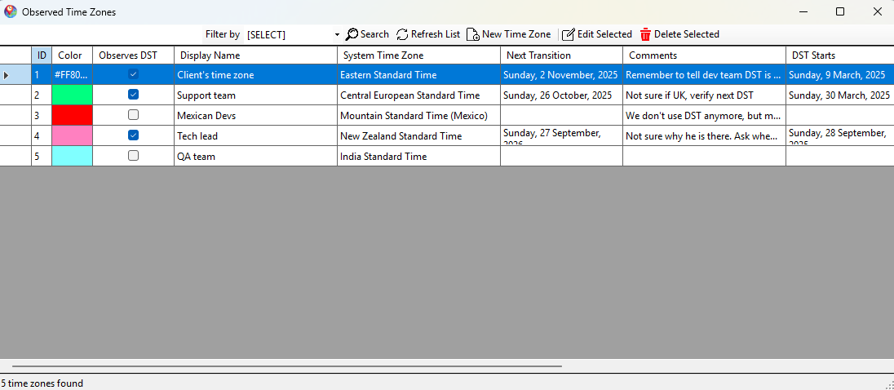
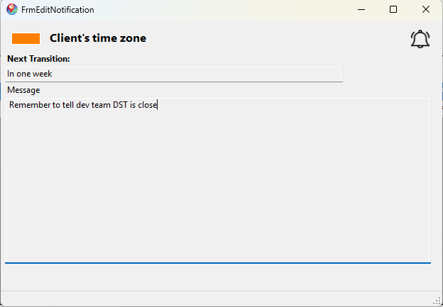

# MadLab.DaylightSavingsNotifier

A robust .NET 8 application for managing and notifying about Daylight Saving Time (DST) changes across time zones. Built with clean architecture, SOLID principles, and modern .NET best practices.

## Project Structure

- **Domain Layer**: Core business entities and rules.
- **Application Layer**: Business logic and orchestration (`TimeZoneNotifierService`).
- **Infrastructure Layer**: Data access and external integrations (Entity Framework Core).
- **WebAPI Layer**: API endpoints and background workers (`DSTNotificationWorker`).

## Features

- **Time Zone DST Management**: Automatically updates and scans time zones for DST changes.
- **Notification System**: Creates notifications for time zones requiring DST updates.
- **Background Processing**: Uses hosted services to run scheduled tasks (e.g., daily at 3 AM).
- **Entity Framework Core and SQLite**: Used for data access and entity tracking.

## Usage

**Front End** : Winforms app where you can add, update, and delete time zones you want to get notifications from about their DST changes





**Back End**: A WebAPI that interacts with the Winforms app, and that also implements a worker process that creates the notifications, it runs every day at 3 a.m. and every time the app starts. All data is contained in a SQLite database.


## Design Principles

- **Clean Architecture**: Separation of concerns between layers.
- **SOLID Principles**: Each class and service has a single responsibility and depends on abstractions.
- **Dependency Injection**: Ensures maintainability and testability.

## Configuration

- Environment-specific settings are managed via ASP.NET Core configuration system.
- Logging is implemented using the built-in logging provider; can be extended with Serilog or others.

## Project Setup
- Ensure you have the necessary tools installed:
	- Visual Studio 2022 or later / Visual Studio Code
	- Docker Desktop (For testing purposes)
- Clone the repository:
	- git clone https://github.com/alfcanres/MadLab.DaylightSavingsNotifier.git
- Set up the following projects as startup projects in your IDE:
	- DSTN.WebAPI
	- DSTN.AdminApp.Winforms
- Build the solution to restore all NuGet packages and compile the code.
- Open Package Manager Console and run the following commands to apply migrations and create the SQLite database:
 ```sh
	cd DSTN.Infrastructure
	dotnet ef database update
  ```
- Run the projects.
- Have fun!


## Deployment

- Open CMD or terminal in the project root directory.
- Run the following command to build the Docker image:
 ```sh
	docker build -t dstn-webapi -f DSTN.WebAPI/Dockerfile .
  ```
- Once the image is built, open Docker Desktop and run a new container from the `dstn-webapi` image.
- Build or publish DSTN.AdminApp.WinForms project. If you are using Visual Studio, you can use the "Publish" option to create a self-contained deployment, or you just build and go to the output folder, it usually is as follows: 
  ``` MadLab.DaylightSavingsNotifier\DSTN.AdminApp.WinForms\bin\Debug\net8.0-windows\ ```
- Go to MadLab.DaylightSavingsNotifier\DSTN.AdminApp.WinForms\App.config and modify the BaseAddress string to point to the address hosted in the Docker container.
``` 
<setting name="BaseAddress" serializeAs="String">
    <value>https://localhost:7215</value>
</setting>
```
- Run the WinForms application by clicking the **DSTN.AdminApp.WinForms.exe** file in the output folder.


## Contributing

1. Fork the repository.
2. Create a feature branch.
3. Commit your changes following the project's coding standards.
4. Submit a pull request.

